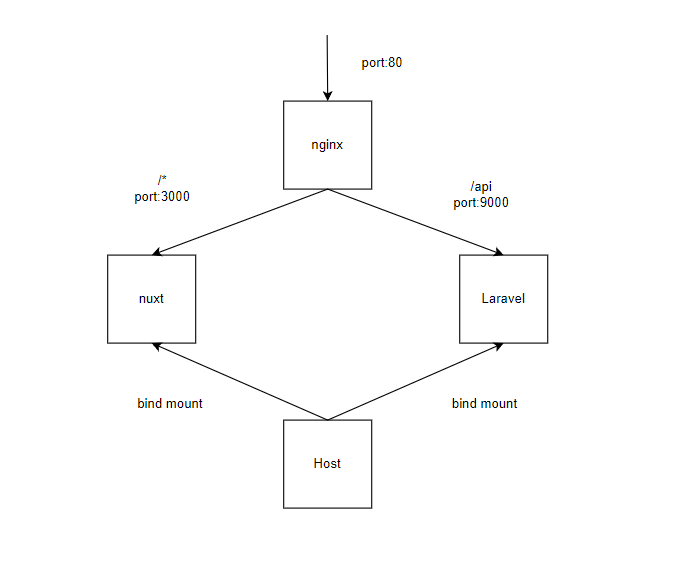

# docker-Laravel-Nuxt.TS

## nginx+nuxt+laravelの基本のdocker構築ファイルです
  
<br>

### 大まかな構成図
  


<br>

### 環境構築手順
- ソースコードをクローンします
    ```
    $ git clone https://github.com/matsuihiroki0221/docker-laravel-vue-base.git
    $ sudo chmod -R 777 .

    // 以下のdockerを入力し、イメージのビルド、コンテナを立ち上げる
    $ docker compose build
    $ docker compose up -d
    ```
    

- Nuxt準備
    ```
    // frontコンテナに入る
    $ docker-compose exec front bash

    // node_modeluesをインストールする
    $ npm run install

    // 開発用サーバを立ち上げる
    $ npm run dev
    ```
- Laravel準備
    ```
    // apiコンテナに入る
    $ docker-compose exec api bash

    // composerを用いてパッケージをインストールする
    $ composer install
    ```
<br>
